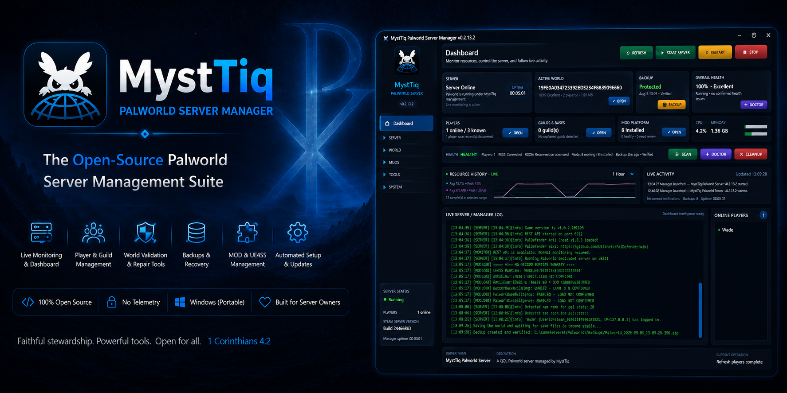
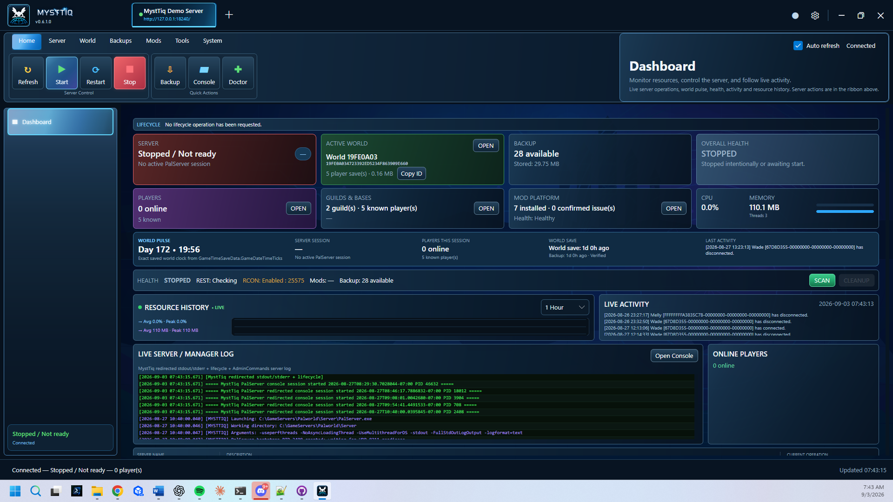
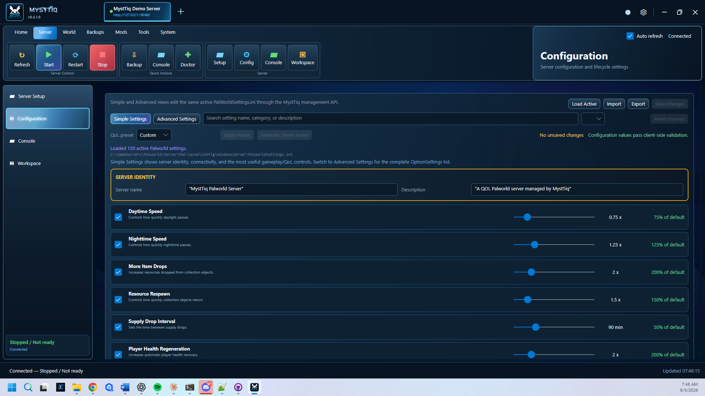
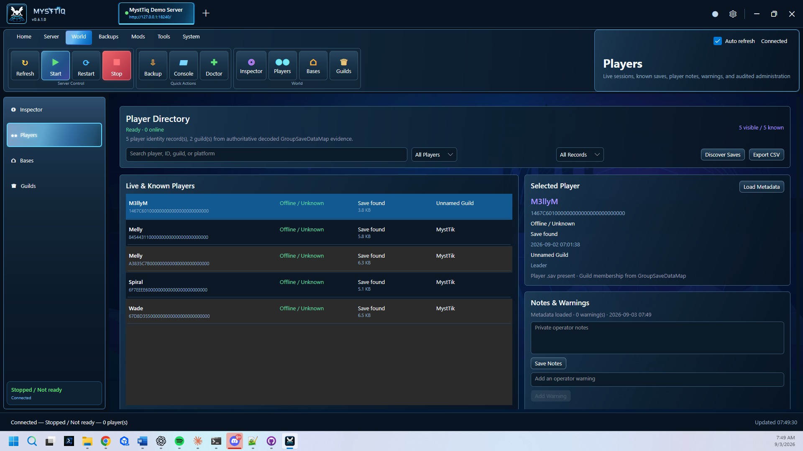
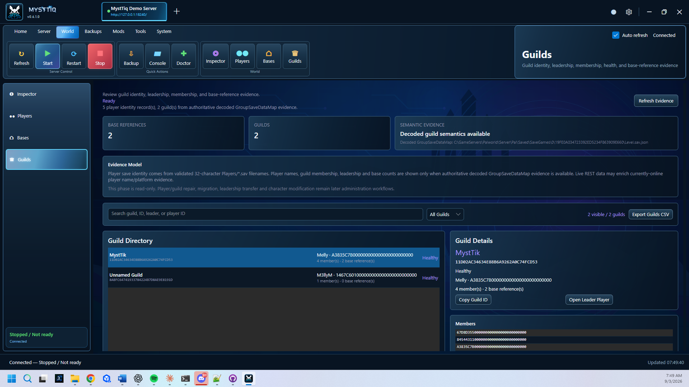
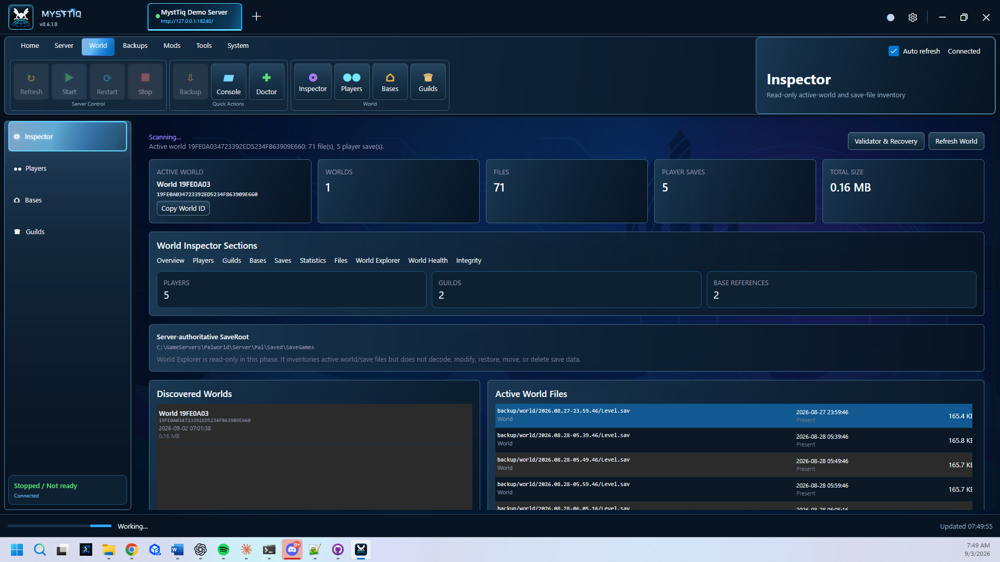
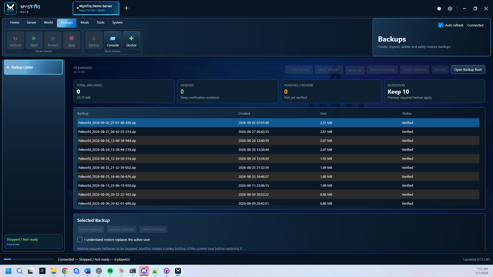
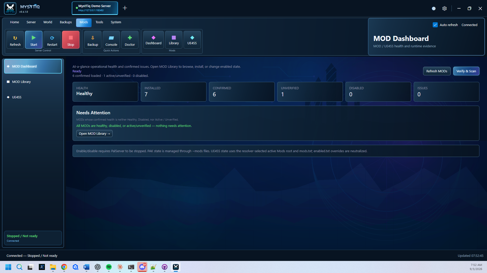
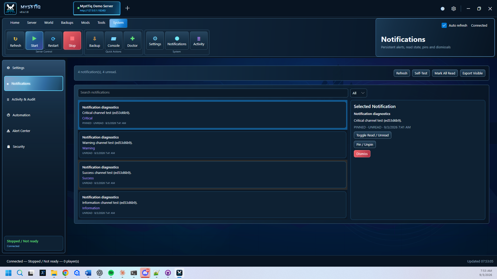

<p align="center">
  
</p>

<h1 align="center">MystTiq Palworld Server Manager</h1>

<p align="center">
  <strong>The Open-Source Administration Suite for Palworld Dedicated Servers</strong>
</p>

<p align="center">
  
  
  
  
  
</p>

<p align="center">
  <a href="../../releases">Download Latest Release</a> •
  <a href="docs/">Documentation</a> •
  <a href="../../issues">Report a Bug</a> •
  <a href="../../issues">Request a Feature</a>
</p>

---

## Powerful. Modern. Open Source.

MystTiq Palworld Server Manager is a free and open-source Windows application designed to simplify hosting, monitoring, maintaining, and repairing **Palworld Dedicated Servers**.

Instead of juggling configuration files, command-line tools, backups, mods, and save editors, MystTiq brings everything together into a single modern desktop application built for both first-time server owners and experienced administrators.

## Highlights

| Feature | Description |
|---|---|
| Modern Dashboard | Live server health, CPU, RAM, and activity monitoring |
| World Explorer | Inspect players, guilds, bases, and world data |
| Player Management | Browse connected players and server information |
| Guild and Base Tools | Inspect guild ownership and base information |
| Backup Center | One-click backups and restore workflows |
| Workshop and UE4SS | Built-in mod management and validation |
| World Validator | Detect issues before they become problems |
| Open Source | MIT licensed and community driven |

## Dashboard

<p align="center">
  
</p>

## Why MystTiq?

> **Managing a dedicated server should be easy.**

Whether you are hosting a family server for a few friends or managing a larger community, MystTiq provides the tools needed to monitor, maintain, and troubleshoot your server through a clean and intuitive Windows interface.

- No subscriptions
- No telemetry
- No unnecessary complexity
- MIT licensed
- Built for self-hosters

## Features

### Server Administration

- Start, stop, and restart
- Live status monitoring
- CPU and RAM history
- Health monitoring
- Notification center
- Activity timeline
- Update management

### World Management

- World Explorer
- Player Inspector
- Guild Manager
- Base Inspector
- Save data inspection

### Backup and Recovery

- One-click backups
- Restore workflow
- Backup validation
- Backup history

### Mod Platform

- Steam Workshop integration
- UE4SS support
- Runtime validation
- Crossplay verification
- Installed mod inventory

### Validation and Repair

- World validation
- Repair planning
- Safe maintenance workflow
- Future Transaction Engine support

## Screenshot Gallery

### Server Settings

<p align="center">
  
</p>

### Player Manager

<p align="center">
  
</p>

### Guild Manager

<p align="center">
  
</p>

### World Explorer

<p align="center">
  
</p>

### Backup Manager

<p align="center">
  
</p>

### Mod Management

<p align="center">
  
</p>

### Notifications

<p align="center">
  
</p>

## Feature Matrix

| Feature | Included |
|---|:---:|
| Live Dashboard | Yes |
| Resource Monitoring | Yes |
| Server Health | Yes |
| World Explorer | Yes |
| Player Inspector | Yes |
| Guild Manager | Yes |
| Base Inspector | Yes |
| Backup Manager | Yes |
| Restore Workflow | Yes |
| Steam Workshop | Yes |
| UE4SS Support | Yes |
| World Validation | Yes |
| Portable Version | Yes |
| Open Source | Yes |
| MIT License | Yes |

## Quick Start

1. Download the latest release.
2. Extract the portable ZIP.
3. Launch **MystTiqPalworldServer.exe**. Windows will request administrator approval.
4. Select your Palworld Dedicated Server installation.
5. Start managing your server.

## Requirements

- Windows 10 or Windows 11 (64-bit)
- Palworld Dedicated Server
- Administrator privileges are required when running MystTiq so it can manage the dedicated server, Windows services, firewall configuration, and protected server paths.

## Download

The latest builds are available from the GitHub **Releases** page.

Available packages include:

- Portable Windows ZIP
- Windows Installer
- Source code

The Windows installer defaults to `C:\GameServers\MystTiqPalworldServer` and requests administrator privileges. The installed application also requests elevation whenever it is launched from its Start Menu or desktop shortcut.

## Building From Source

Clone the repository:

```bash
git clone https://github.com/Wad3M/MystTiq-Palworld-Server-Manager.git
```

Open:

```text
PalworldServerManager.slnx
```

Build:

```text
Release | x64
```

Or use the standard MystTiq PowerShell validation workflow from the repository root:

```powershell
Get-ChildItem . -Recurse -Filter *.ps1 | Unblock-File
.\Build.ps1 Clean
.\Build.ps1 Validate
.\Build.ps1 All
```

## Documentation

Documentation will live under the `docs` folder.

Planned guides include:

- Installation
- Configuration
- Backup and restore
- World Explorer
- Mod management
- Troubleshooting
- FAQ


### v0.2.15.6 MOD lifecycle hardening

Normal modded server starts now pass through a centralized `ModLifecycleCoordinator`. MystTiq repairs known UE4SS `enabled.txt`/`mods.txt` drift, rescans the authoritative active runtime, and blocks startup when enabled MOD files are missing, an enabled UE4SS MOD is outside the Active Mods Root, a state mismatch remains, a duplicate logical install is detected, or reconciliation cannot guarantee state because of filesystem warnings. **Start Without MODs intentionally bypasses this gate** so operators retain a recovery/isolation path. The MOD Dashboard can also export TXT and JSON verification reports with deterministic repair recommendations.

### v0.2.15.6 FIX1 runtime-loaded synchronization

MOD Library runtime status now refreshes live UE4SS evidence on every authoritative scan, preserves actual UE4SS runtime-folder aliases for Workshop/managed packages, and automatically refreshes the Library after the 45-second startup evidence window. This prevents valid running MODs from remaining stuck at **Not loaded** because of a pre-start resolver cache or package/folder-name mismatch.

## Roadmap

| Version | Status | Highlights |
|---|:---:|---|
| **v0.2.15.1** | Completed | UE4SS runtime resolver foundation: dynamic modern/legacy path detection, runtime-log verification, mismatch diagnostics, and session-cached authoritative path resolution |
| **v0.2.15.2** | Completed | MOD inventory, install, enable/disable, delete, state repair, `mods.txt`, `enabled.txt`, folder access, and UE4SS health checks consume the authoritative Active Mods Root |
| **v0.2.15.3** | Baseline | Copy-first legacy-to-active MOD migration, active-root-safe ZIP layout normalization, conflict preservation, and migration diagnostics |
| **v0.2.15.4** | Completed RC work | Runtime-loaded status from UE4SS.log, active-runtime presence, active-vs-legacy diagnostics, and expanded UE4SS path health UI |
| **v0.2.15.5** | Completed | Centralized MOD health evaluation, consistent Dashboard/Library health states, and persistent Workshop identity resolution |
| **v0.2.15.6** | Completed Baseline | Pre-start MOD reconciliation, startup health gate, repair recommendations, verification report export, and runtime-loaded hotfix investigation |
| **v0.2.15.7** | Completed Baseline | Unified session-aware runtime state service, immutable runtime snapshots, single-source MOD loaded state, revisioned diagnostics, and session-safe log evidence |
| **v0.2.15.8** | Current RC | Runtime Evidence Engine refinement, expanded positive UE4SS signatures, structured evidence explanations, and event-driven Dashboard/Library synchronization |
| **v0.3.0.0** | Planned | Linux support foundation and platform abstraction layer while preserving the mature Windows workflow |
| **v1.0** | Goal | Stable production release |

## Contributing

Contributions, bug reports, feature requests, and documentation improvements are always welcome.

Please read:

- [CONTRIBUTING.md](CONTRIBUTING.md)
- [CODE_OF_CONDUCT.md](CODE_OF_CONDUCT.md)

before opening issues or submitting pull requests.

## Security

If you discover a security issue or accidentally expose credentials, please follow [SECURITY.md](SECURITY.md).

## License

Released under the **MIT License**.

See [LICENSE](LICENSE) for complete details.

## Disclaimer

MystTiq Palworld Server Manager is an independent community project.

It is **not affiliated with, endorsed by, or sponsored by Pocketpair, Inc.**

Palworld and all related trademarks are the property of their respective owners.

## About MystTiq

MystTiq is an open-source initiative focused on building modern, approachable management tools for self-hosted game servers.

The long-term vision is to provide a consistent management experience across multiple dedicated server platforms while remaining completely free and open source.

---

<p align="center">
  <strong>If MystTiq has been helpful, consider starring the repository.</strong>
</p>

<p align="center">
  Built for the self-hosting community.
</p>


### v0.2.15.6 FIX2 — Runtime-loaded Session Persistence
Hotfix candidate that keeps positively observed UE4SS load state stable for the lifetime of the current PalServer session, even when UE4SS rotates logs. Session evidence resets at stop/new-session boundaries.


### v0.2.15.7 — Unified Runtime State Architecture

MystTiq now owns MOD runtime state in a single session-aware `RuntimeStateService`. The service begins from the current UE4SS log boundary when a new PalServer session is prepared, reads only new runtime evidence for that session, latches positive `Starting Lua mod` evidence, exposes immutable revisioned snapshots, and clears state when the server session ends. The MOD scanner, Library, Dashboard, verification/export inputs, and runtime diagnostics now consume the same runtime state instead of maintaining a separate UI latch. This prevents periodic inventory refreshes or UE4SS log rotation from turning valid current-session MODs back to **Not loaded**, while also preventing prior-session startup lines from being inherited by a new server session.


### v0.2.15.8 — Runtime Evidence Engine Refinement

Runtime verification now uses a dedicated `ModRuntimeEvidenceEngine` instead of letting each surface independently decide whether a MOD is loaded. The engine treats the unified current-session runtime snapshot and the MOD Library's authoritative `LoadedByUe4ss` state as primary evidence, records the matched alias/evidence source in verification details, and recognizes additional conservative UE4SS positive-load signatures beyond `Starting Lua mod`. Runtime-state changes now push synchronization to the existing MOD Library and Dashboard rows, eliminating timing windows where the Library can show **Loaded** while the Dashboard remains **Runtime Unverified**.


### Current release candidate — v0.2.15.10
MOD Functional Verification & Capability Analysis adds observational capability profiling and Confirmed Running evidence above the v0.2.15.8 FIX1 baseline.


### v0.2.15.10 — Native Runtime Module Evidence
Current release candidate adds exact-path PalServer process-module evidence for native/hybrid UE4SS mods while preserving current-session isolation and observational safety.
