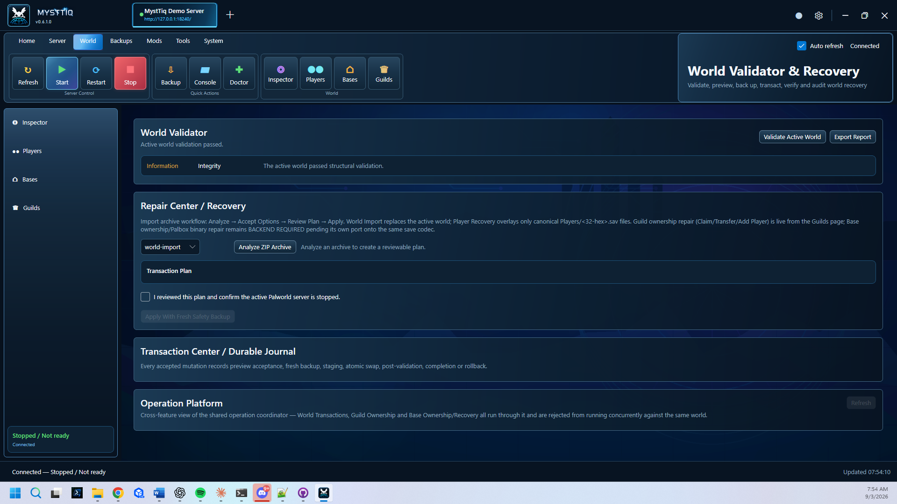
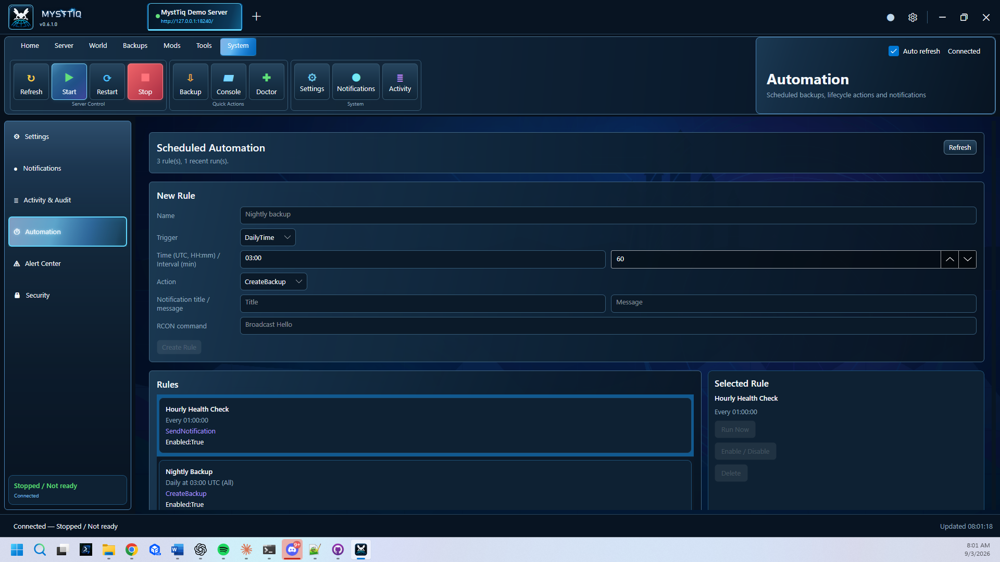
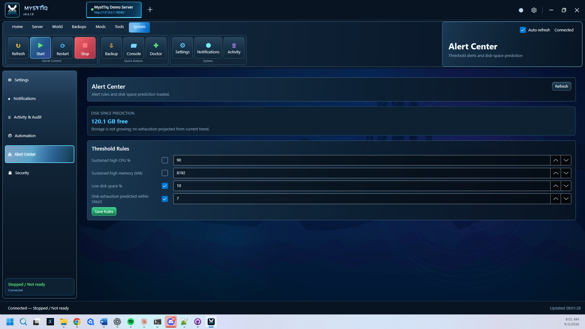
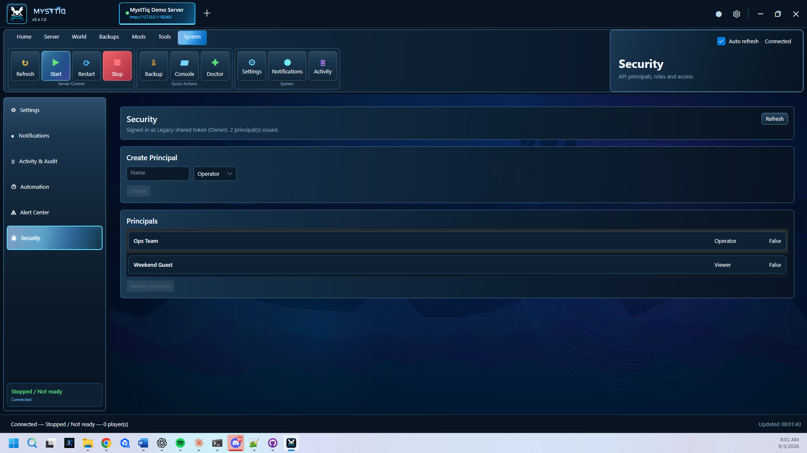

<p align="center">
  
</p>

<h1 align="center">MystTiq Palworld Server Manager</h1>

<p align="center">
  <strong>The Open-Source Administration Suite for Palworld Dedicated Servers</strong>
</p>

<p align="center">
  
  
  
  
  
</p>

<p align="center">
  <a href="../../releases">Download Latest Release</a> •
  <a href="docs/">Documentation</a> •
  <a href="../../issues">Report a Bug</a> •
  <a href="../../issues">Request a Feature</a>
</p>

---

## Overview

MystTiq Palworld Server Manager is a free and open-source administration suite for hosting, monitoring, maintaining, and troubleshooting **Palworld Dedicated Servers** — on Windows or Linux.

It combines server lifecycle controls, configuration, backups, world inspection, SteamCMD management, Steam Workshop and UE4SS MOD workflows, diagnostics, health reporting, scheduled automation, and live world telemetry in one interface.

> **Current release candidate:** v0.6.11.0 — Stale-Instance Fix & WAN Reachability Diagnostics
> **Official validated Windows baseline:** v0.2.16.4
> **Official Linux/headless baseline:** v0.3.0.5

The management layer is a persistent, headless-first background service (`MystTiq.Core` + `MystTiq.HeadlessHost`) that owns every PalServer lifecycle, configuration, backup, world-mutation, and automation decision. A shared Avalonia desktop client (`MystTiq.Desktop`) runs on both Windows and Linux as a thin API client — closing or crashing the GUI never stops the managed server. See [Architecture and Platform Direction](#architecture-and-platform-direction) below.

For what shipped in the current release candidate, see [`CHANGELOG.md`](CHANGELOG.md) and [`release-notes/`](release-notes/) — implementation detail belongs there, not duplicated in this file.

## Highlights

| Area | What MystTiq provides |
|---|---|
| Dashboard | Server state, operational health, CPU/RAM history, activity, notifications, players, and WORLD PULSE telemetry |
| Server Administration | Start, stop, restart, force stop, update, configuration, adoption, and recovery workflows |
| World Management | World, player, guild, base, save-data, validation, inspection, and repair-oriented tools |
| Backup & Recovery | One-click backups, restore workflows, formal backup classes with retention protection, validation, history, and maintenance-safe handling |
| Automation & Alerts | Scheduled backup/lifecycle automation, RCON warning countdowns, threshold and disk-space-prediction alerting |
| Security | Role-based API access (Viewer/Operator/Admin/Owner) layered on top of authenticated bearer/TLS remote management |
| Multi-Server Fleet | Any number of independently isolated servers under one management process, fleet dashboard, staggered Backup/Doctor/Update All, per-server role scoping |
| Windows Service | Install, start, stop and monitor MystTiq as a real Windows Service with automatic crash recovery, matching the existing Linux systemd support |
| Character Migration | Migrate a player's guild membership to a new account identity (e.g. Xbox → Steam) with preview, safety backup, and audited source-character disposition |
| Diagnostics Platform | One unified Doctor/Environment health report driving the real Overall Health badge, Fix Automatically, per-check Recheck, and client-side DNS/TCP/TLS/HTTP connection diagnostics that work even when the server is unreachable |
| Provider Framework | Kick/ban routes through REST first, automatically falling back to Palworld RCON when REST is disabled or unreachable, with visible per-provider health; cross-setting port-conflict detection surfaces as a real Diagnostics finding |
| Player Registry | Persistent per-player first/last seen, session count, tracked playtime, and Steam ID/UID mapping, plus a bounded join/leave event history and abandoned-base detection from orphaned guild data |
| World Editing & Recovery | Guild membership repair (remove a dangling member reference with no matching save) on the proven transactional pattern; player identity mismatch detection (Steam ID collisions, missing save files) as a real Diagnostics finding |
| MOD Safety & Alerts | Automatic pre-mutation snapshot and one-click rollback for every MOD install/delete; Alert Center notification when an enabled MOD's health degrades |
| Idle Auto-Stop | Warns, does a final live player recheck, then stops a server that's had 0 players for a configurable number of minutes — reuses the same RCON broadcast/lifecycle-stop path as any other automation rule |
| Clone World | Duplicates a server profile's entire installation (binaries + world) into a new, independent profile with non-colliding ports, for running a second copy alongside the original |
| MOD Platform | Steam Workshop and UE4SS inventory, enable/disable, verification, compatibility checks, runtime evidence, and repair recommendations |
| Diagnostics | Server Doctor, crash analysis, runtime/session inspection, verification-report export, and environment checks |
| Distribution | Portable Windows package, Windows installer, Linux headless service, source code, checksums, and built-in MystTiq release awareness |

## Dashboard

<p align="center">
  
</p>

The Dashboard is designed to answer two questions quickly:

1. **Is the server operational?**
2. **What is happening in the world right now?**

Operational Health is intentionally separate from informational/runtime-confidence states so uncertainty does not incorrectly make a healthy server appear degraded.

### WORLD PULSE

WORLD PULSE combines authoritative saved-world data with the active PalServer session:

- saved Palworld day/time
- save freshness
- current PalServer session uptime
- current and peak online players
- session joins, leaves, and unique players
- latest backup age
- most recent player transition

World time is read from saved-world evidence and is not extrapolated from process uptime.

## MOD Health and Runtime Evidence

MystTiq separates **deployment/configuration health** from **runtime proof**.

- **Healthy** — required files/state are valid and no confirmed failure is present.
- **Confirmed Running / Loaded** — positive runtime evidence exists.
- **Active / Unverified** — enabled/deployed, but no strong runtime proof is currently available. This is neutral to Overall Health.
- **Disabled** — intentionally disabled and neutral to Overall Health.
- **Failed / Error** — a confirmed actionable failure that can reduce MOD Platform and Overall Health.

Runtime evidence can include supported UE4SS log signals and native DLL/module evidence. Normal modded starts use pre-start reconciliation and a startup health gate. **Start Without MODs** remains an intentional recovery/isolation path.

## Scheduled Automation, Alerts & Backup Classes

A persisted trigger → condition → action engine schedules backups, lifecycle actions, notifications, and RCON commands, including warning-countdown broadcasts before a scheduled restart. Backups carry a class (Manual/Scheduled/Emergency/Safety); routine retention cleanup only ever touches Scheduled backups by default, so manual and safety copies are protected. An Alert Center watches CPU, memory, and disk space — including a real disk-space-exhaustion projection — and routes into the same Notification Center used everywhere else in the app.

## Role-Based API Access

A minimal role model (Viewer / Operator / Admin / Owner) sits on top of the existing authenticated bearer-token/TLS boundary. Every existing zero-config deployment keeps working unchanged — the original shared bearer token still resolves to full administrative access — while an Owner can issue additional, narrower-scoped tokens (including time-limited guest access) for other operators without sharing the primary credential.

## Multi-Server Fleet

One management process can now run any number of independently isolated Palworld servers — each with its own paths, backups, automation rules, and lifecycle state — while every existing single-server deployment keeps working with zero configuration changes (an existing config upgrades automatically to a single-entry fleet). The Fleet page lists every configured server with independent live status, and Backup All / Doctor All / Update All run staggered, fleet-wide actions from one place. A role can be scoped to just one server in the fleet, and a lock on one server's world/lifecycle state never blocks another's.

## Secure Remote API Enrollment & TLS Provisioning

Remote/LAN management is an explicit, testable enrollment workflow. Loopback-only operation remains the default.

Headless commands:

```bash
./mysttiq-server api-tls-create ...
./mysttiq-server api-remote-enable ...
./mysttiq-server api-remote-disable ...
```

The self-signed certificate generator creates a 3072-bit RSA server certificate with:

- SHA-256 signature
- TLS Web Server Authentication EKU
- IP SAN for the selected bind address
- `localhost` SAN
- optional DNS SAN
- validity limited to 825 days
- password stored in a separate protected secret file

Remote API exposure remains explicit. `api-remote-enable` requires a non-loopback literal IP and writes a configuration where both bearer authentication and TLS are enabled. `api-remote-disable` returns the API to the safe `127.0.0.1:8213` default.

One-command Linux enrollment:

```bash
bash ./scripts/Configure-MystTiqRemoteApi.sh \
  --bind 192.168.1.248
```

The script prompts for confirmation, performs one `sudo` authorization, creates/reuses the token and certificate, fixes service-user ownership/permissions, updates the configuration, reinstalls/restarts the service, validates systemd, and tests authenticated HTTPS locally.

Windows LAN acceptance:

```powershell
.\scripts\Test-MystTiqRemoteApi.ps1
```

The Windows test retrieves the bearer token through the existing trusted SSH-key channel into process memory only and verifies:

- HTTPS reachability from Windows
- `/healthz` returns HTTP 200
- unauthenticated management access returns HTTP 401
- valid bearer authentication returns HTTP 200
- lifecycle JSON is returned

MystTiq does **not** automatically change Linux firewall rules during enrollment.

## Passwordless Linux Deployment & SSH Trust

A dedicated SSH key is the standard MystTiq deployment path.

One-time setup from Windows PowerShell:

```powershell
.\scripts\Initialize-MystTiqLinuxSSH.ps1
```

The helper creates a dedicated Ed25519 key under the current user's `.ssh` directory when needed, installs **only the public key** into the Linux account's `authorized_keys`, and verifies passwordless login.

Normal deployment then becomes:

```powershell
.\scripts\Deploy-Test-MystTiqLinux.ps1 -Extended
```

The deployment wrapper:

- prefers the dedicated MystTiq SSH identity automatically
- uses OpenSSH `BatchMode=yes` with password authentication disabled while key authentication is active
- uses the same identity for `ssh` and `scp`
- fails with a clear setup instruction if the dedicated key is missing or invalid
- allows interactive password prompting only when `-AllowPasswordFallback` is explicitly requested
- never copies the private SSH key to Linux
- continues to verify the transferred archive by SHA-256 before extraction
- invokes the version-matched Linux acceptance runner automatically

## Headless Configuration & Local Management API

Persistent Linux headless configuration and the management API boundary.

Default configuration:

```text
/etc/mysttiq/mysttiq.json
```

Example configuration:

```text
config/mysttiq.linux.example.json
```

Configuration commands:

```bash
./mysttiq-server config-show
./mysttiq-server config-validate
sudo ./mysttiq-server config-write-default
```

The configuration owns:

- PalServer / SteamCMD / backup / runtime paths
- PalServer launch arguments
- startup and graceful-stop timeouts
- service polling
- automatic-recovery backoff, budget, and window
- local API enablement, bind address, and port
- authentication/RBAC and TLS boundaries

The default local management endpoint is:

```text
http://127.0.0.1:8213
```

The API rejects non-loopback bindings unless authentication and TLS are both explicitly enabled (see [Secure Remote API Enrollment](#secure-remote-api-enrollment--tls-provisioning) above).

Core local API endpoints:

```text
GET  /healthz
GET  /api/v1/status
GET  /api/v1/service
GET  /api/v1/config
POST /api/v1/server/start
POST /api/v1/server/stop
POST /api/v1/server/restart
```

Lifecycle mutations are serialized through a central Operation Coordinator, so simultaneous start/stop/restart requests — and any concurrently in-flight world/guild/base save mutation — cannot race each other.

## Linux systemd Service & Automatic Recovery

The Linux headless host runs as a real background service.

Service commands:

```bash
./mysttiq-server service-status
sudo ./mysttiq-server service-install
sudo ./mysttiq-server service-install --start-now
sudo ./mysttiq-server service-uninstall
```

`service-install` copies the current self-contained host to `/opt/mysttiq/bin/mysttiq-server`, creates `mysttiq-palworld.service`, reloads systemd, and enables boot startup. Starting the service remains explicit unless `--start-now` is supplied.

The installed service runs the long-lived `service-run` supervisor. MystTiq—not systemd directly—continues to own PalServer lifecycle policy. The supervisor:

- starts or adopts the native Linux PalServer
- polls observed lifecycle/process/port state
- detects unexpected PalServer disappearance
- attempts bounded automatic recovery with backoff
- exits on repeated recovery failure so systemd's own `Restart=on-failure` policy can take over
- catches SIGTERM/SIGINT and requests graceful PalServer shutdown before the service exits
- logs service-level output through the systemd journal while preserving PalServer's detached console log

The systemd unit uses `Restart=on-failure`, a 10-second restart delay, bounded systemd start attempts, `NoNewPrivileges=true`, and a dedicated non-root service user selected at installation time.

## Linux Headless Lifecycle Control

```bash
./mysttiq-server status
./mysttiq-server start
./mysttiq-server stop
./mysttiq-server restart
```

The lifecycle layer:

- blocks duplicate starts
- launches `PalServer.sh` detached from the interactive SSH session
- observes the real `PalServer-Linux-Shipping` process
- verifies UDP `8211` before declaring startup ready
- records lifecycle state under `/opt/mysttiq/runtime`
- sends **SIGTERM first** for graceful shutdown
- escalates to **SIGKILL only after the configured graceful timeout**
- detects disappearance of a previously observed/managed process as a possible crash
- writes detached console output to `/opt/mysttiq/runtime/palserver-console.log`
- returns stable headless exit codes suitable for service/automation integration

## Headless Core & Cross-Platform Foundation

`MystTiq.Core` and `MystTiq.HeadlessHost` are the shared, no-GUI foundation both platforms run on:

```text
MystTiq.Core
    └── platform-neutral models, profiles, distribution detection,
        SteamCMD policy, session inspection, operation/automation/
        security contracts, and per-platform lifecycle services

MystTiq.HeadlessHost
    └── the management API host: lifecycle, configuration, backups,
        world/guild/base transactions, automation scheduler, alerts,
        RBAC, and every other server-authoritative feature
```

The headless host can detect the OS, resolve PalServer/SteamCMD paths, discover native PalServer processes, inspect guarded ports, and drive the full SteamCMD install/update plan on either platform.

The Linux SteamCMD policy includes:

```text
+@sSteamCmdForcePlatformType linux
```

This is required by the validated reference environment; without the explicit platform override SteamCMD returned `Missing configuration` for App `2394010` even though the Linux depot was available.

### Linux reference environment

The Linux foundation is validated against:

- **Ubuntu Server 24.04.4 LTS (Noble Numbat)**
- **x86_64 / amd64**
- **Linux kernel 6.8.0-137-generic**
- Valve Linux SteamCMD
- Palworld Dedicated Server Steam App `2394010`
- native Linux server executable `Pal/Binaries/Linux/PalServer-Linux-Shipping`
- validated game listener: UDP `8211`

Detailed environment notes are maintained in [`docs/linux/TESTED_ENVIRONMENT.md`](docs/linux/TESTED_ENVIRONMENT.md).

## Features

### Server Administration

- Start, stop, restart, and force-stop workflows
- Running-server adoption and active-session tracking
- CPU/RAM monitoring
- SteamCMD server install, update, and validation
- Server configuration and environment verification
- Lifecycle and operational-health monitoring
- Activity and notification surfaces

### World Management

- World Explorer and World Inspector
- Live-safe `Level.sav` snapshot reading
- Player Inspector and management tools
- Guild and base inspection, ownership transfer, and recovery
- Save-data validation
- Maintenance/repair workflows, all transactional (preview → safety backup → server-side transaction → validate → journal/audit)

### Backup and Recovery

- One-click backups with Manual/Scheduled/Emergency/Safety classification
- Restore workflow
- Backup validation/history
- Class-scoped retention preview/apply
- Maintenance-safe backup handling

### Automation & Analytics

- Scheduled (daily-time or interval) trigger → condition → action rules
- Backup, lifecycle, notification, and RCON actions with warning-countdown broadcasts
- Alert Center: sustained CPU/memory thresholds, low disk space, disk-space-exhaustion prediction
- Historical CPU/RAM/world-size charts with honest gap and restart markers

### MOD Platform

- Steam Workshop integration
- UE4SS runtime/root resolution
- MOD inventory, install, enable/disable, delete, and reconciliation
- Current-session UE4SS runtime evidence
- Native UE4SS DLL module evidence
- Crossplay/compatibility verification
- Verification report export
- Repair recommendations

### Application Update Awareness

Server Setup and Update Center can compare the installed MystTiq version with the latest published full GitHub release.

MystTiq reports:

- **UPDATE AVAILABLE**
- **UP TO DATE**
- **DEVELOPMENT BUILD**
- **CHECK FAILED**

The check is informational; MystTiq does not silently replace the running application.

## Screenshot Gallery

### Server Settings
<p align="center"></p>

### Player Manager
<p align="center"></p>

### Guild Manager
<p align="center"></p>

### World Explorer
<p align="center"></p>

### Backup Manager
<p align="center"></p>

### MOD Management
<p align="center"></p>

### Notifications
<p align="center"></p>

### World Validator
<p align="center"></p>

### Automation
<p align="center"></p>

### Alert Center
<p align="center"></p>

### Security
<p align="center"></p>

## Quick Start

1. Download the latest release for your platform.
2. **Windows:** extract the portable ZIP or run the installer, then launch `MystTiqPalworldServer.exe`.
   **Linux:** extract the headless tarball and run `./mysttiq-server service-install --start-now` (see [Linux systemd Service](#linux-systemd-service--automatic-recovery) above), or run the Avalonia desktop build directly.
3. Select or configure the Palworld Dedicated Server installation.
4. Verify the environment.
5. Start managing the server.

## Requirements

- Windows 10/11 (64-bit) **or** Linux (Ubuntu 24.04 LTS is the validated reference environment; other modern distributions are expected to work)
- Palworld Dedicated Server
- SteamCMD for server install/update workflows
- UE4SS only when using UE4SS-based MOD functionality
- Administrator/root privileges for install-time and service-management operations

## Installation

Release assets are published on the GitHub **Releases** page.

The Windows installer defaults to:

```text
C:\GameServers\MystTiqPalworldServer
```

The installation directory remains user-selectable. On Linux, `service-install` installs the headless host to `/opt/mysttiq/bin/mysttiq-server`.

## Building From Source

Clone the repository:

```bash
git clone https://github.com/Wad3M/MystTiq-Palworld-Server-Manager.git
```

Then use the standard repository workflow:

```powershell
Get-ChildItem . -Recurse -Filter *.ps1 | Unblock-File

.\Build.ps1 Clean
.\Build.ps1 Validate
```

Run the current release candidate's version-aware logic gate, which resolves the version from `Directory.Build.props`, unblocks scripts, runs Clean, runs strict Validate, then runs that version's logic tests with its own build gate:

```powershell
.\scripts\Test-CurrentRelease.ps1 -ProjectRoot . -ExportJson
```

Cross-publish individual targets:

```powershell
.\Build.ps1 DesktopWindows   # Windows Avalonia desktop + headless sidecar
.\Build.ps1 DesktopLinux     # Linux Avalonia desktop + headless sidecar
.\Build.ps1 WindowsHeadless  # Windows persistent headless host
.\Build.ps1 LinuxHeadless    # Linux headless host + systemd deployment scripts
```

## Architecture and Platform Direction

MystTiq is headless-first: a persistent management service owns every server-authoritative decision, and every GUI is a thin client of it.

```text
MystTiq.Desktop (Avalonia, Windows + Linux)
        ↓ authenticated management API
MystTiq.HeadlessHost (persistent service / systemd unit)
        ↓
MystTiq.Core (shared platform-neutral contracts and services)
        ↓
PalServer
```

```text
MystTiq.Core
  ├── ServerPlatformProfile / IServerPathProfile (Windows + Linux)
  ├── IServerDistributionPlatformService (Windows + Linux)
  ├── IServerLifecycleService (Windows + Linux)
  ├── Operations/   -- OperationCoordinator, resource-key locking, operation records
  ├── Automation/   -- scheduled trigger/condition/action contracts
  └── Security/     -- role-based principal contracts

MystTiq.HeadlessHost
  └── the management API: lifecycle, configuration, backups, world/guild/base
      transactions, automation scheduler, alerts, RBAC, MOD management, and
      every other server-authoritative feature

MystTiq.Desktop
  └── Avalonia MVVM shell; no direct PalServer or remote-filesystem ownership

src/PalworldManager
  └── the original Windows-only WPF client, kept as the historical
      feature-parity reference during the Avalonia migration
```

Closing or crashing any GUI never stops the managed server or the persistent service. Detailed platform-audit information is maintained in [`docs/architecture/`](docs/architecture/).

### Roadmap

| Version | Status | Focus |
|---|:---:|---|
| **v0.2.16.4** | Shipped | Final Windows-only platform baseline |
| **v0.3.x** | Shipped | Linux/headless foundation: lifecycle, SteamCMD, systemd, management API, secure enrollment |
| **v0.4.x** | Shipped | Windows persistent service foundation, network diagnostics, Avalonia navigation/theme foundation |
| **v0.5.x** | Shipped | Functional Visual Shell Integration: full Avalonia GUI parity with the legacy WPF app, guild/base ownership transaction platform, desktop shell UI/UX consolidation |
| **v0.6.0.0** | Shipped | Architecture baseline: Operation Coordinator, resource-key locking |
| **v0.6.1.0** | Shipped | Advanced administration, automation, RBAC, analytics, formal backup classes |
| **v0.6.2.0** | Shipped | Multi-server fleet: plural server profiles, per-server isolation and locking, fleet dashboard and bulk actions |
| **v0.6.3.0** | Shipped | Windows service hardening, character/account migration, Server Setup vs. Update Center cleanup |
| **v0.6.4.0** | Shipped | Unified Doctor/Environment diagnostics, real Overall Health, Fix Automatically, local-PC connectivity diagnostics |
| **v0.6.5.0** | Shipped | Provider Framework (REST/RCON player-moderation fallback) and Configuration Intelligence's first slice (port-conflict detection) |
| **v0.6.6.0** | Shipped | Persistent Player Registry (identity/session history, Steam ID/UID mapping, join/leave events) and abandoned-base detection |
| **v0.6.7.0** | Shipped | Guild membership repair (Remove Broken Member) and player identity mismatch detection |
| **v0.6.8.0** | Shipped | MOD backup/staged install/rollback and Alert Center integration for MOD/UE4SS health |
| **v0.6.9.0** | Shipped | Idle Auto-Stop with warning and final player recheck |
| **v0.6.10.0** | Shipped | Clone World feature, plus extended live verification (sustained run, real 2-instance fleet, cross-machine connection, closed the v0.6.9.0 idle-stop verification gap) |
| **v0.6.11.0** | **Current RC** | Fixes a real stale-backend bootstrap bug (version-blind instance reuse), UI polish (Start button, nav color, header tagline), and new WAN reachability diagnostics (public IP, router UPnP port-mapping detection/repair, external port-checker hand-off) |
| **v0.7.x** | Planned | Themes, skins, UI personalization and original Palworld-inspired MystTiq icon set |
| **v0.8.x** | Planned | Adaptive application/server/network efficiency, priorities, eco modes and host/per-server dashboards |
| **v1.0** | Goal | Stable production release |

The full ten-milestone `v0.6.x.0` breakdown, with scope and acceptance detail for each, lives in [`docs/roadmap/MystTiq_v0.6_Grouped_Development_Roadmap.md`](docs/roadmap/MystTiq_v0.6_Grouped_Development_Roadmap.md); that ten-milestone family (v0.6.0.0–v0.6.9.0) shipped complete on 2026-09-03. `v0.6.10.0` is a direct user-requested addition beyond that original plan (Clone World plus extended live verification) — see [`docs/architecture/v0.6.10.0-clone-world-live-verification.md`](docs/architecture/v0.6.10.0-clone-world-live-verification.md). Historical release implementation detail belongs in [`CHANGELOG.md`](CHANGELOG.md), [`release-notes/`](release-notes/), and [`docs/history/`](docs/history/) rather than being duplicated here.

## Documentation

The documentation layout is intentionally separated by purpose:

- [`README.md`](README.md) — current product overview
- [`CHANGELOG.md`](CHANGELOG.md) — complete release history
- [`RELEASE_CHECKLIST.md`](RELEASE_CHECKLIST.md) — active release/promotion checklist
- [`docs/README.md`](docs/README.md) — documentation index
- [`docs/architecture/`](docs/architecture/) — current architecture/audit documents
- [`docs/linux/`](docs/linux/) — Linux reference environment and headless implementation notes
- [`docs/roadmap/MystTiq_v0.6_Grouped_Development_Roadmap.md`](docs/roadmap/MystTiq_v0.6_Grouped_Development_Roadmap.md) — the authoritative, testable v0.6.x roadmap
- [`docs/roadmap/PRODUCT_ROADMAP.md`](docs/roadmap/PRODUCT_ROADMAP.md) — forward-looking product direction
- [`docs/roadmap/WINDOWS_BACKPORT_REGISTRY.md`](docs/roadmap/WINDOWS_BACKPORT_REGISTRY.md) — improvements discovered during Linux work for shared/core or Windows backport
- [`docs/history/`](docs/history/) — archived architecture and feature implementation notes
- [`docs/release/`](docs/release/) — publication/release process documents
- [`release-notes/`](release-notes/) — version-specific build, test, apply, and release notes
- [`CONTRIBUTING.md`](CONTRIBUTING.md) — contribution workflow
- [`SECURITY.md`](SECURITY.md) — security reporting
- [`CODE_OF_CONDUCT.md`](CODE_OF_CONDUCT.md) — community standards

## Contributing

Contributions, bug reports, feature requests, and documentation improvements are welcome. Please review [CONTRIBUTING.md](CONTRIBUTING.md) and [CODE_OF_CONDUCT.md](CODE_OF_CONDUCT.md).

## Security

For security issues or accidentally exposed credentials, follow [SECURITY.md](SECURITY.md).

## License

Released under the **MIT License**. See [LICENSE](LICENSE).

## Disclaimer

MystTiq Palworld Server Manager is an independent community project. It is **not affiliated with, endorsed by, or sponsored by Pocketpair, Inc.** Palworld and related trademarks are the property of their respective owners.

---

<p align="center"><strong>If MystTiq has been helpful, consider starring the repository.</strong></p>
<p align="center">Built for the self-hosting community.</p>
