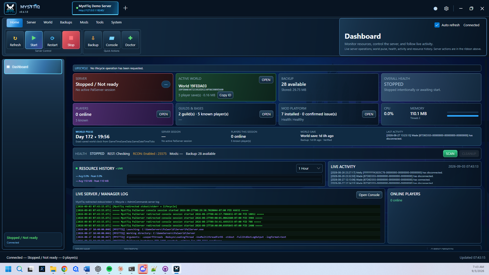
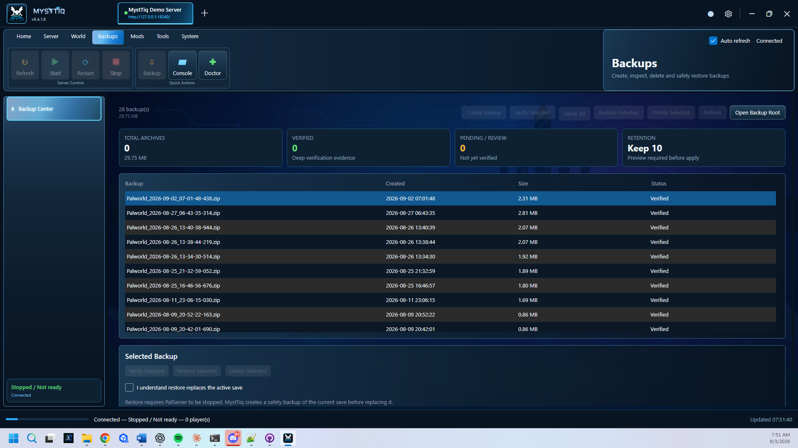
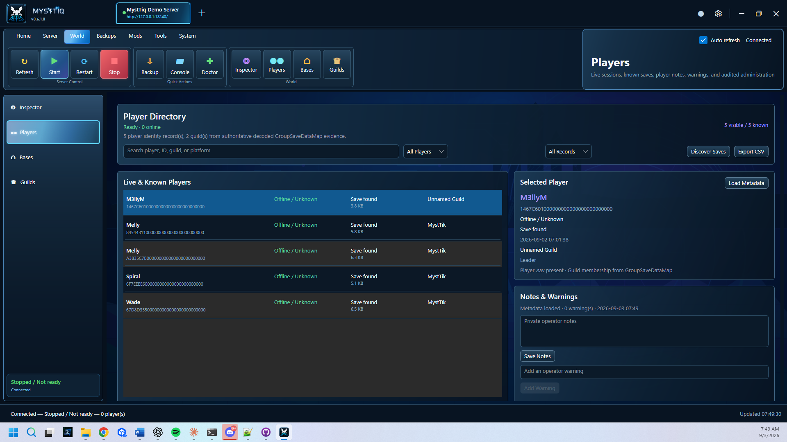
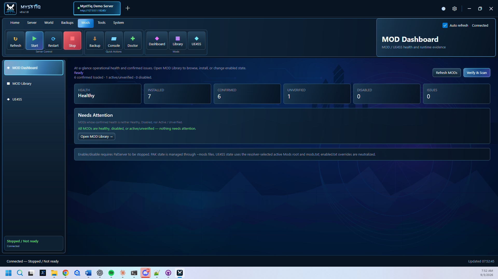

<!-- MystTiq v1.0.6.1: file reviewed for this release (2026-10-06). -->
<p align="center">
  
</p>

<h1 align="center">Your worlds. Your servers. One place to manage them.</h1>

<p align="center">An open-source desktop for running Palworld communities.<br>Manage servers, protect worlds, organize mods, and share administration across your team.</p>

<p align="center">
  <a href="LICENSE"></a>
  
  
  
</p>

<p align="center">
  <a href="https://github.com/Wad3M/MystTiq-Palworld-Server-Manager/releases"><strong>Browse downloads</strong></a> ·
  <a href="#get-started">Get started</a> ·
  <a href="docs/roadmap/PRODUCT_ROADMAP.md">Roadmap</a> ·
  <a href="https://github.com/Wad3M/MystTiq-Palworld-Server-Manager/issues/new/choose">Get help / contribute</a>
</p>

**Current version: v1.0.6.1 · Accepted baseline: v1.0.0.0**

MystTiq 1.0 is the first stable release. Downloads are on the Releases page; Windows is the packaged download, and Linux builds are available from source.

## What's new in v1.0.6.1

**Your character, not a new one.** If the MystTiq service on your PC is older than the app, the Dashboard now says so and replaces it in one click, so fixes like the identity guard are really running your server. No Launcher preset adds the start options that gave players a different character any more, and the identity alert names them when it happens.

**Also new since 1.0 (v1.0.6.0): Pals in the Pal box.** On the Players page, add a Pal to a player's Pal box or remove one, with the same preview, confirmation, checked safety backup and verification as the inventory edits. An added Pal is a copy of one of its kind already in a Pal box, so its stats are the game's own. **MODs laid out as the game folder** (blueprint MODs for UE4SS, a PAK with scripts) now install where the game loads them.

**Also new since 1.0 (v1.0.5.0): a MOD browser.** On the MOD Library page, search your Downloads folder, Thunderstore, CurseForge, GitHub releases you trust, or Nexus Mods, and install a MOD's file in one step. MystTiq downloads only from that source, shows what the archive holds, and asks first. Archives that would install wrongly are refused with the reason, and a UE4SS MOD packed in a folder now installs correctly.

**Also new since 1.0 (v1.0.4.0): guarded save edits.** On the Players page, remove a stack from a player's saved inventory or add an item to it. Each edit is previewed and confirmed, runs only while the server is stopped, takes a checked safety backup first, and is verified before it replaces the world.

**Also new since 1.0 (v1.0.3.0): a read-only browser view and a Docker image.** Open `/web` on your MystTiq service in any browser, sign in with your MystTiq account, and see each server's status, players and backups. It can't change anything. The headless service also comes as a Linux container image that keeps everything in one mounted folder and runs the Palworld server inside it.

**Also new since 1.0 (v1.0.2.0): unattended reliability.** A server that is still running but has stopped answering is now restarted, with an alert, and a healthy one is never touched. Every alert MystTiq sends to Discord, email or a webhook is recorded with its result, and the Dashboard warns when a channel has not delivered for a week or its last send failed.

**Also new since 1.0 (v1.0.1.0): Update, on every row.** Every component in the Update Center has an Update button. MystTiq downloads and checks its own new version; the server, UE4SS, PalDefender, pip and Save Tools update in place; the rest open their official download page. SteamCMD's is greyed out, because it updates itself.

**Also new since 1.0 (v1.0.0.6): buttons and tags that say what they do.** Every button is coloured by what it does, the same on every page: red to delete or remove, purple to open, green to verify, blue to save or apply, teal to refresh, amber to restore or reset. Status tags are green when ready, amber when they need attention, red when something is missing and grey when switched off.

**Also new since 1.0 (v1.0.0.5): Bases and Guilds, each in its own way.** Bases are places: where each one is, which Pals work there, and a button that shows it on the map. Guilds are people: a roster by name with the leader and who's online, and the bases they hold.

**Also new since 1.0 (v1.0.0.4): restores you can check by the day.** Every backup shows its world's in-game day, and a restore tells you the day the world is now at. The Dashboard's day is current again. A restore no longer fails just because a file is briefly in use, and when something keeps it busy, MystTiq names it.

**Also new since 1.0 (v1.0.0.3): PalDefender on the MODs page.** PalDefender and the UE4SS loader now show on the MODs page with their version, whether they loaded, and an on/off switch. If the UE4SS loader is off, your UE4SS MODs are marked as not loading. Dragging a ZIP onto the install box works again.

**Also new since 1.0 (v1.0.0.2): unique player names.** Each player name now belongs to one account, with upper and lower case counted as the same name. A player who joins with someone else's name is turned away, and you can reserve or block names on the Players page.

**Also new since 1.0 (v1.0.0.1): launcher, players and a cleaner exit.** A new **Server > Launcher** page with one-click troubleshooting presets, and servers that start just like a manual start. MystTiq now protects each Steam player's character when they join, helps when a start gets stuck (test without MODs, or find the MOD), lists the server's local and public addresses on the Dashboard, and shows Steam IDs on the Players page. Closing the window sends MystTiq to the tray; **Exit** stops everything.

[Release notes](release-notes/v1.0.6.1.md) · [Translation inventory](docs/i18n/UI_TEXT_INVENTORY.md) · [Help review a translation](CONTRIBUTING.md#translation-feedback)

## See your server at a glance



*Repository screenshots illustrate the interface and may show an earlier build.*

## Built around everyday administration

| Work you need to do | Tools in MystTiq |
| --- | --- |
| **Run your servers** | Setup and adoption, start/stop/restart, updates, configuration, scheduling, diagnostics and crash recovery |
| **Protect your worlds** | Backups, retention and restore checks, plus guarded world/player/guild repair and migration workflows |
| **Look after your community** | Player tools, world map, kits, item/Pal tools, teleport points, whitelist, temporary bans and Discord integration; some actions require a supported mod/provider |
| **Keep mods organized** | Inventory, enable/disable, health checks, rollback, UE4SS/Workshop support and Nexus integration |
| **Understand the host** | CPU, memory, disk and network information, seven-day history, priority, eco mode, processor cores and game-level bandwidth settings |
| **Share administration** | Named accounts, Viewer/Operator/Admin/Owner roles, scoped permissions, audit records and remote connections with pinned TLS; disabled controls name the role they need |
| **Make it comfortable** | Dark, Light, Midnight, High contrast and Follow system modes, density settings, themed artwork and 12 language options |

Nexus download options depend on the account and provider. Game-level bandwidth settings are not OS-level traffic shaping.

<details>
<summary><strong>More of the interface: backups, players and mods</strong></summary>

### Backups



### Players



### Mods



</details>

## Get started

1. Open [Releases](https://github.com/Wad3M/MystTiq-Palworld-Server-Manager/releases) and read the selected version's notes.
2. Download its **Windows-x64.zip**, extract the entire folder, and run **MystTiq.Desktop.exe**. Keep the `headless` folder alongside it. The package includes .NET.
3. Configure a local service or connect to a remote MystTiq service. Keep existing server data and backups separate from the application folder.

| Download | Who it's for |
| --- | --- |
| `Windows-x64.zip` | Windows users who want to run the app |
| `FullSource.zip` / GitHub source archives | Developers who want to build or inspect the source |
| `SHA256SUMS.txt` | Checking that downloaded ZIPs match the release |

Upgrading? Back up your server data, extract the new app into a fresh folder and follow that release's upgrade notes. Keep your existing configuration/data locations and verify the connection before resuming administration.

**Closing the desktop does not stop a managed server.** The headless service owns operations and persistent state; the desktop connects to it locally or remotely.

## Languages and platform status

English · 简体中文 · Español · Português (Brasil) · Русский · Deutsch · Français · 日本語 · 한국어 · Italiano · Polski · Türkçe

- **Translation:** the desktop's labels and messages, the service's messages and the game's item/Pal names are available in all 12 languages, with English always available. Suggestions from native speakers are welcome.
- **Windows x64:** the release packages the desktop, matching service and native console helper.
- **Linux x64:** the desktop and service build from the same source. Chinese/Japanese/Korean need suitable system fonts such as Noto Sans CJK.

## Release history

| Release | Status | Focus |
| --- | --- | --- |
| v1.0.6.1 | Current | Fixes a player getting a new character: an older MystTiq service still running is flagged and replaced in one click; no Launcher preset adds the options behind it |
| v1.0.6.0 | Previous | Add or remove a Pal in a player's Pal box; MODs laid out as the game folder (LogicMods, PAK with scripts) install |
| v1.0.5.0 | Earlier | A MOD browser: your Downloads folder, Thunderstore, CurseForge, GitHub releases and Nexus Mods, each archive checked before it installs |
| v1.0.4.0 | Earlier | Guarded save edits: remove or add an item in a player's saved inventory, with a checked backup first |
| v1.0.3.0 | Earlier | A read-only browser view (status, players, backups) and a Docker image of the headless service |
| v1.0.2.0 | Earlier | A frozen server is restarted; proof that alerts reach Discord, email and webhooks; the Linux service tested under systemd |
| v1.0.1.0 | Earlier | Update on every Update Center row: MystTiq, the server, UE4SS, PalDefender, pip and Save Tools, or the official page |
| v1.0.0.6 | Earlier | Buttons and tags coloured by what they do: Delete red, Open purple, Verify green, the same on every page |
| v1.0.0.5 | Earlier | Bases and Guilds pages that look and work differently: places with locations and workers, people with a roster |
| v1.0.0.4 | Earlier | Restores report the world's day; each backup shows its day; the Dashboard's day is current; restores no longer fail on a briefly busy file |
| v1.0.0.3 | Earlier | PalDefender and the UE4SS loader on the MODs page; drag and drop fixed |
| v1.0.0.2 | Earlier | Unique player names: each name belongs to one account, case ignored |
| v1.0.0.1 | Earlier | Server > Launcher; characters protected on join; help for stuck starts; addresses on the Dashboard; a clean Exit from the tray |
| v1.0.0.0 | Stable baseline | The first stable release |

What comes next is in the [roadmap](docs/roadmap/PRODUCT_ROADMAP.md). Release history lives in the [changelog](CHANGELOG.md).

## Build and contribute

Install the **.NET 10 SDK** and **PowerShell 7**, then run from the repository root:

```powershell
dotnet build PalworldServerManager.slnx -c Release
pwsh ./scripts/Package-GitHubRelease.ps1 -Runtime win-x64
```

For Linux packaging use `-Runtime linux-x64`; after extracting, grant execute permission to `MystTiq.Desktop` and `headless/mysttiq-server`. Windows native console capture additionally requires MSVC x64 and `scripts/Build-ConsoleProxy.ps1`; the release workflow includes this step.

The app consists of `MystTiq.Desktop`, `MystTiq.HeadlessHost` and `MystTiq.Core`. The former Windows app and installer were removed in v0.8.26.0 and remain in Git history.

[Contribution guide](CONTRIBUTING.md) · [Publishing guide](docs/release/README.md) · [Release checklist](RELEASE_CHECKLIST.md) · [Linux testing](docs/linux/TESTED_ENVIRONMENT.md) · [Security reporting](SECURITY.md) · [Code signing policy](CODE_SIGNING_POLICY.md) · [Privacy policy](PRIVACY.md)

## License and attribution

MystTiq code is [MIT licensed](LICENSE). Palworld names and third-party/game artwork belong to their respective owners; the code license does not grant rights to those assets. MystTiq is an independent community project and is not affiliated with Pocketpair.
